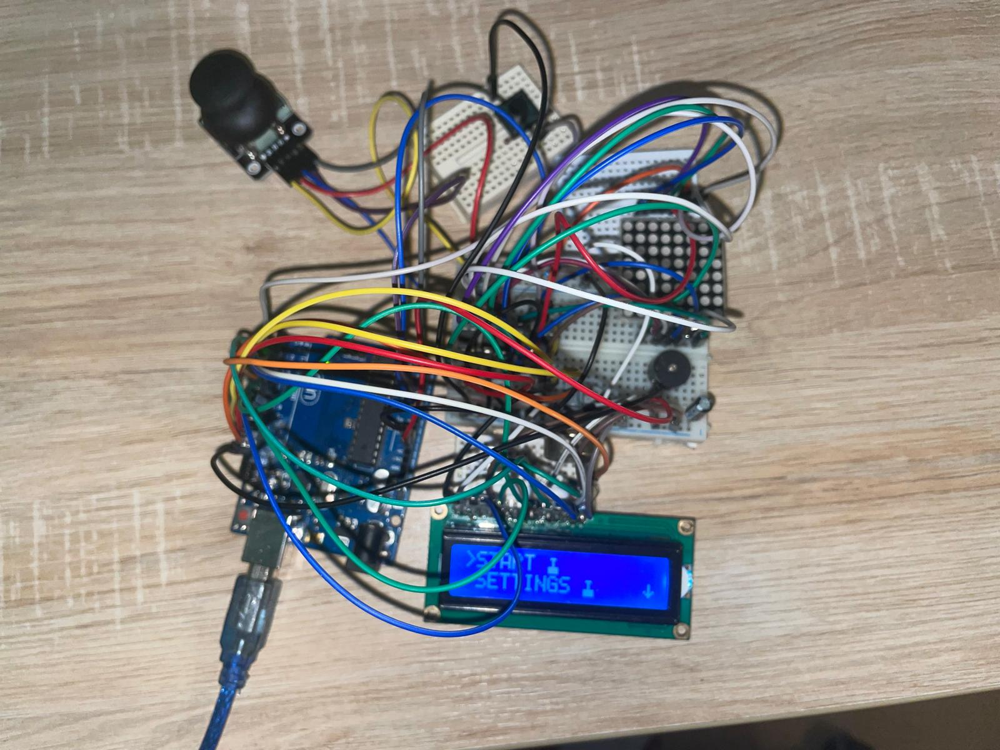

# 🎮  Project README: BomberMan Game

## 🌟 Overview
This is a Bomberman like game developed as a third-year computer engineering project. This Arduino-based game combines strategy, quick thinking, and a bit of luck. Players navigate through a matrix, place bombs to destroy walls, and avoid getting caught in the blast radius. The project involves hardware components like an LED matrix, joystick, buttons, and an LCD display, along with software written in C++ for the Arduino platform.
## 🖼️ Picture of the final design
  

  
  

  
## 📖 Backstory

**Game Story:** My recreation of the classic Bomberman game using Arduino is more than just a project; it's a tribute to my first encounter with video gaming. This game holds a special place in my heart, tracing back to when I was just 4 years old. My first gaming experience was on my father's work computer, where an internet provider's CD introduced me to four iconic games: Bomberman, Heroes III, Dungeon Siege, and Red Alert 2.

Despite not knowing English at the time, I was captivated by Bomberman's simple yet compelling gameplay. I quickly learned the game's core mechanics - placing bombs strategically to destroy walls and skillfully avoiding the ensuing explosions. After about 10 hours of playtime, I achieved what felt like a monumental feat at that age - beating the game. That triumph and the joy it brought me remain vivid in my memory, even 17 years later.

Creating this Arduino-based version of Bomberman is my way of reconnecting with that cherished childhood memory. It's a homage to the game that introduced me to a world of strategy, excitement, and the sheer fun of gaming.

## ⚙️ Features
- **Dynamic Gameplay:** Players move in an 8x8 LED matrix, placing bombs to clear walls.
- **Difficulty Levels:** Adjustable game difficulty settings (from Easy to Hard).
- **High Score Tracking:** EEPROM-based high score saving and retrieval.
- **Interactive LCD Display:** Real-time game information and menu navigation.
- **Sound Effects:** Engaging sound effects for menu selection and bomb explosions.
- **Energy Saving:** Adjustable LCD and LED matrix brightness levels.

## 🧩 Components
- Arduino Board
- 8x8 LED Matrix
- LCD Display (16x2)
- Joystick Module
- Buzzer
- EEPROM for data storage
- Button
- MAX7219 Driver
- Resistors

## 🔧 Setup
- **Assemble Hardware:** Connect the LED matrix (to the driver), LCD display, joystick, and buzzer to the Arduino according to the schematic provided in the code.
- **Load Software:** Upload the BomberMan code to the Arduino board.
- **Initial Configuration:** Set your preferred brightness and sound settings through the game menu.

## 🕹️ Gameplay
- **Navigation:** Use the joystick to move up, down, left, and right on the LED matrix.
- **Bomb Placement:** Press the joystick button to place a bomb.
- **Objective:** Clear all the blocks by strategically placing bombs while avoiding being caught in the blast.
- **Lives & Levels:** The game continues across different levels until all lives are lost.

## 🏆 High Scores
High scores are saved in EEPROM, retaining the top three scores with player initials. Beat a high score to enter your initials and secure your place on the leaderboard!
## Settings Menu
Use the joystick up and down to cycle through the menus. Utilize the external button to enter menus and the joystick button to confirm selections within the settings menu. All changes are saved to the EEPROM.
- **Brightness Control:** Adjust the brightness of the LED matrix and LCD. Navigate through the brightness levels and select your preferred setting.
- **Sound Toggle:** Enable or disable game sounds. Toggle between sound on/off options and select as per your preference.
- **Difficulty Selection:** Choose the difficulty level that suits your skill. Select from various difficulty levels ranging from Easy to Hard.

## 📹 Video:
- [Video Presentation](https://youtu.be/iZat5utNYsA)

## 🙌 Credits
Developed by Balan Teodor, this project represents a blend of programming skills, electronics, and game design, showcasing the power of Arduino in creating interactive applications.
